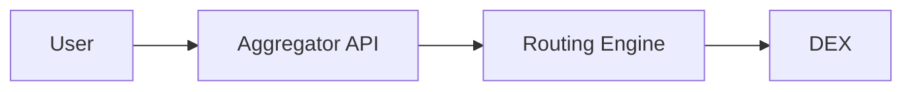

# 🌫️ VeilForge
[](https://vimeo.com/1171557218?share=copy&fl=sv&fe=ci)
## Finding the Optimal Swap Route — Privately.

> **VeilForge is a privacy-preserving DEX aggregator powered by Zero Knowledge and Chainlink CRE.**

VeilForge discovers the **best swap route across decentralized exchanges** while keeping **user balances, wallet identity, and trading strategy completely private**.

Unlike traditional aggregators that rely on **centralized routing engines or solver networks**, VeilForge computes optimal swap paths **deterministically inside Chainlink CRE workflows**.

This enables **trust-minimized intelligent routing with private execution.**

---

# ✨ Key Idea

VeilForge is a **private DEX aggregator**.

It provides:

- 🔐 **Private swaps**
- 🧠 **Deterministic routing**
- ⚡ **Best price discovery**
- 🌍 **Sybil-resistant anonymous identity**

All powered by:

- **Zero Knowledge proofs**
- **World ID**
- **Chainlink CRE**

---

# 🧩 The Problem

Current DeFi routing systems suffer from three major problems.

## 1️⃣ No Privacy

Most DEX aggregators expose:

- wallet address
- balances
- trading strategies
- full transaction history

This creates opportunities for:

- MEV attacks
- copy trading
- liquidity extraction

---

## 2️⃣ Centralized Routing Engines

Protocols like **Matcha, 0x, and many aggregators** rely on centralized routing services.

Typical architecture:

Problems:
- opaque routing
- trust assumptions
- potential censorship

---

## 3️⃣ Solver-Based Systems

Intent protocols such as **CoW Swap** depend on **solver networks**.

Problems with solver systems:

- complex architecture
- solver competition latency
- reliance on external actors
- unpredictable routing outcomes

---

# ⚡ The VeilForge Solution

VeilForge introduces a new primitive:

## Deterministic Private Routing

Instead of centralized routing engines or solver markets:

1️⃣ Routing is computed inside **Chainlink CRE workflows**  
2️⃣ The best DEX is discovered using **deterministic logic**  
3️⃣ Execution happens via **private ZK commitments**

The result:

> A **private DEX aggregator with trust-minimized routing**.

---

# 🧠 Core Architecture


Routing logic is executed **offchain inside CRE but deterministically verified**.

No centralized routing server.

No solver markets.

---

# 🔐 Privacy Layer

VeilForge uses **commitment-based private wallets**.

A wallet is represented as a commitment:
```
walletCommitment = Poseidon2(nullifier, secret, balance)
```

| Component | Purpose |
|-----------|--------|
| nullifier | prevents double spending |
| secret | private wallet secret |
| balance | encrypted balance |

Balances remain **completely private**.

---

# 🌍 Identity Layer


To prevent Sybil attacks while preserving anonymity, VeilForge integrates **World ID**.

Users create an identity commitment:
```
identityCommitment = Poseidon2(uuid, secret)
```

After verifying via World ID, the commitment is inserted into an **identity Merkle tree**.

Users later prove membership using **Zero Knowledge proofs**.

This ensures:

- one human = one identity
- full anonymity

---

# 🌳 Identity Mixer

Verified identities are stored in a **Merkle tree**.

Users generate ZK proofs that show:

> "I am a verified human"

without revealing **which identity they are**.

This allows anonymous participation.

---

# 👛 Private Wallets

A VeilForge wallet exists only as a **cryptographic commitment**.
```
walletCommitment = Poseidon2(nullifier,secret,balance)
```

The wallet does not expose:

- address
- balance
- identity

All operations update commitments using **Zero Knowledge proofs**.

---

# 💰 Private Liquidity Pool

Users interact with a **shielded liquidity pool**.

Supported actions:

- Deposit
- Swap
- Withdraw

Each operation proves validity using ZK circuits.

No balances are revealed on chain.

---

# 🔄 Private Swap Aggregation


When a user wants to swap tokens:

1️⃣ User generates a **ZK proof of balance**

2️⃣ Relayer triggers a **Chainlink CRE workflow**

3️⃣ CRE computes the **best DEX**

4️⃣ Swap route is encoded and executed

The swap executes **without revealing wallet identity or balance**.

---

# 🧠 Deterministic Routing with Chainlink CRE

VeilForge uses **Chainlink CRE workflows** for price discovery and route computation.

The workflow:

1. Fetches liquidity pools from market APIs
2. Evaluates price, liquidity, and fees
3. Computes estimated outputs
4. Selects the best pool
5. Constructs router calldata

The workflow sorts pools by best output and selects the winning DEX.

Routing logic is implemented inside the CRE workflow itself.

---

# 🧩 Swap Route Construction

After selecting the optimal DEX, the workflow constructs the swap call.

The system determines:

- router contract
- swap interface
- parameters
- ETH value for execution

Example output:
{
"routerAddress": "0x...",
"interface": "function swapExactTokensForTokens(...)",
"parameters": [...],
"value": "0",
"dex": "aerodrome-base"
}

This output is then encoded into a **route payload**.

---

# ⚙ Settlement Layer

The settlement contract receives:
(routerAddress, value, calldata)

Execution:
router.call(calldata)

This enables:

- DEX-agnostic execution
- flexible routing
- future protocol compatibility

---

# 🏗 System Architecture

```mermaid
flowchart LR

U[User]

U --> P[Generate ZK Balance Proof]

P --> R[Relayer]

R --> C[Chainlink CRE Workflow]

C --> D[Liquidity Discovery]

D --> E[Best DEX Selection]

E --> F[Swap Route Construction]

F --> S[Settlement Contract]

S --> X[DEX Router Execution]

X --> O[Private Settlement]
```

---

## 📍 Deployed Addresses

### 🏦 Core Contracts (Base mainnet)
| Contract | Address |
|---------|---------|
| **Pool** (entrypoint) | [`0x271a99F3f1B14D6E0C8eBA5Ad304504b0df6BE23`](https://basescan.org/address/0x271a99F3f1B14D6E0C8eBA5Ad304504b0df6BE23) |
| Hasher | [`0x9EF654839817Bfb93d8F2b335802de839ffF94A0`](https://basescan.org/address/0x9EF654839817Bfb93d8F2b335802de839ffF94A0) |
| IdentityVerifier | [`0xbc95641e5A3357531C1AEDAF9207DB2059c8E852`](https://basescan.org/address/0xbc95641e5A3357531C1AEDAF9207DB2059c8E852) |
| IDMixer | [`0xE0B4a2E7923b8f5c6eE8D2ccD9CABb16545b4E71`](https://basescan.org/address/0xE0B4a2E7923b8f5c6eE8D2ccD9CABb16545b4E71) |
| DepositVerifier | [`0x4c15B33EEaBc4a78033E9d48FA3D73A234779819`](https://basescan.org/address/0x4c15B33EEaBc4a78033E9d48FA3D73A234779819) |
| WithdrawVerifier | [`0x6DaB9EEe428a9284c5AF8E9376CB9680118b7d7E`](https://basescan.org/address/0x6DaB9EEe428a9284c5AF8E9376CB9680118b7d7E) |

---

## 📁 Project Structure

```text
veilforge/
├── contracts/src/
│   ├── identityMixer/
│   │   ├── Mixer.sol        # zk-ID Merkle tree & identity commitments
│   │
│   ├── pool.sol             # Private liquidity pool + settlement contract
│
├── circuits/
│   ├── identity/src/
│   │   └── main.nr           # zk-ID circuit
│   │
│   ├── deposit/src/
│   │   └── main.nr           # Deposit proof circuit
│   │
│   ├── withdraw/src/
│   │   └── main.nr           # Withdraw proof circuit
│
├── frontend/                 # ui
│
├── relayer/
│   ├── index.ts               # Relayer entry point, executes tx on behalf of users
│
├── merkleTreeManager/        # off-chain merkle tree manager for providing merkle proofs for commitments
|
├── cre-workflow/
│   ├── identity              # WorldID verification using api
|   ├── optimizer             # optimal dex route calculation using coingecko api and LLM
|
```
---

# 🧰 Tech Stack

| Component | Technology |
|----------|-----------|
Frontend | Next.js |
Smart Contracts | Solidity |
ZK Circuits | Noir |
Identity | World ID |
Routing | Chainlink CRE |
Backend | Node.js |
Relayer | Express |
Market Data | CoinGecko |

---

# ⚔️ Competitive Analysis

| Feature | VeilForge | 1inch | 0x | CoW Swap |
|--------|-----------|------|----|---------|
Private swaps | ✅ | ❌ | ❌ | Partial |
Deterministic routing | ✅ | ❌ | ❌ | ❌ |
Centralized routing engine | ❌ | ✅ | ✅ | ❌ |
Solver dependency | ❌ | ❌ | ❌ | ✅ |
AI route construction | ✅ | ❌ | ❌ | ❌ |

VeilForge combines:

- **DEX aggregation**
- **privacy**
- **trust-minimized routing**

in a single architecture.

---

# 🚀 Example User Flow

```mermaid
flowchart LR

A[User opens VeilForge]

A --> B[Create Identity Commitment]

B --> C[Verify with World ID]

C --> D[Create Private Wallet]

D --> E[Deposit USDC into Private Pool]

E --> F[Request Token Swap]

F --> G[Relayer triggers CRE Workflow]

G --> H[CRE computes Best DEX Route]

H --> I[Swap executed privately]

I --> J[User withdraws tokens]
```


---

# 🔮 Future Roadmap

- Private cross-chain swaps
- MEV-resistant execution
- intent-based private trading
- private liquidity aggregation across chains

---

# 🏆 Built For

**Chainlink Convergence Hackathon**

Technologies used:

- Chainlink CRE
- Zero Knowledge Proofs
- World ID

---

---

# 🌫️ VeilForge

> *Forge your path through liquidity — unseen.*
